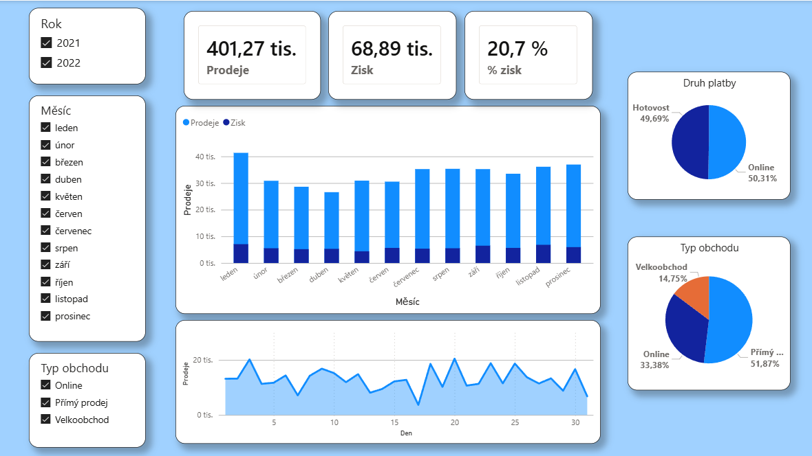

# Power-BI-sales-dashboard
Interaktivní dashboard pro analýzu prodejů

Cíl projektu:
Vytvořit přehledný a interaktivní dashboard pro sledování klíčových metrik (tržby, ziskovost) podle času a prodejních kanálů.

Co jsem si na projektu procvičil:
* Import a úpravu dat v Power Query.
* Tvorbu počítaných metrik (Measures) a vizualizací.
* Využití průřezů (slicerů) pro interaktivní filtrování pro koncového uživatele.

### Náhled dashboardu:

